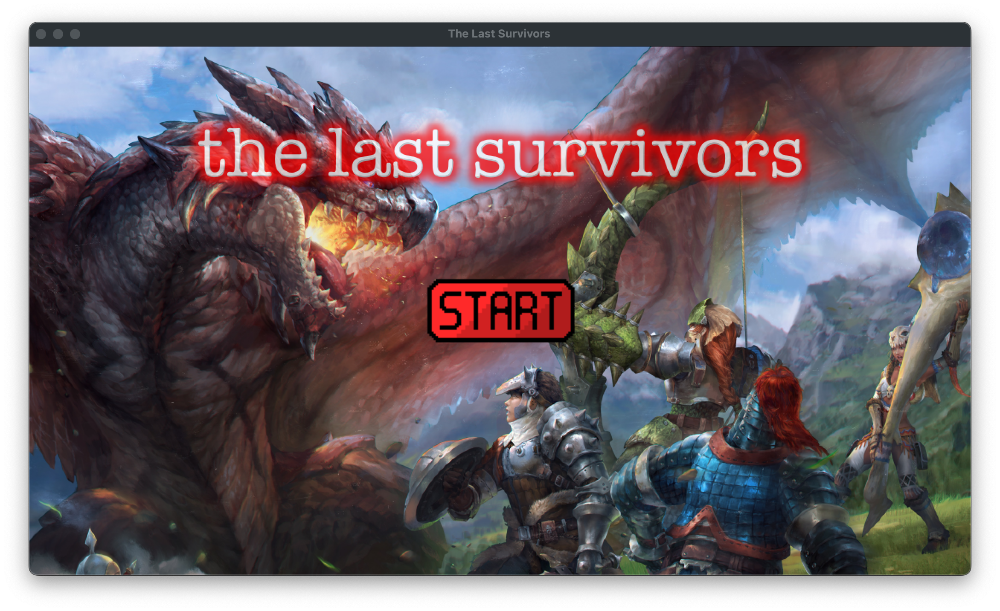
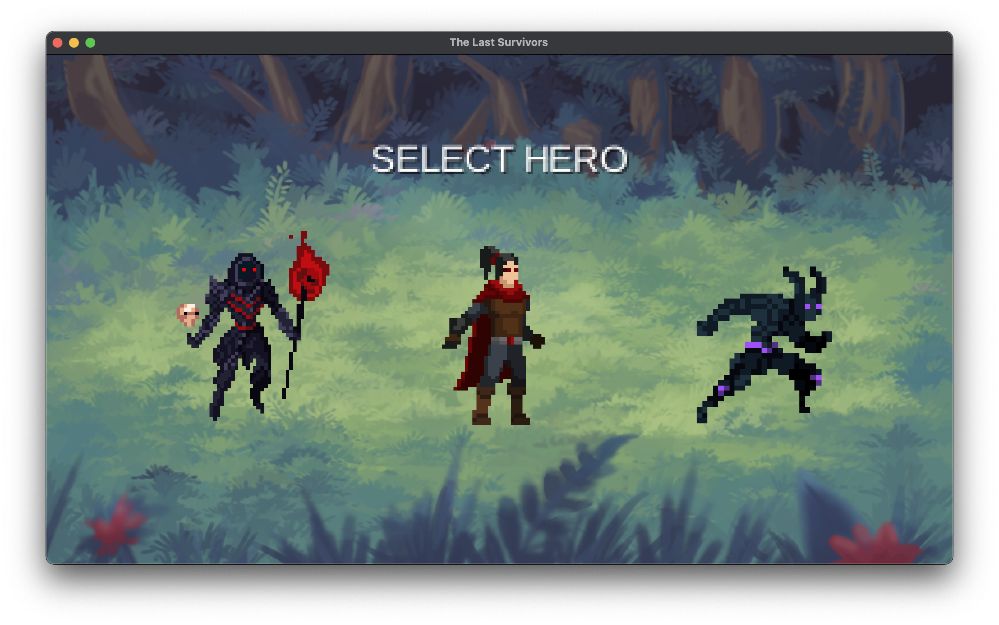
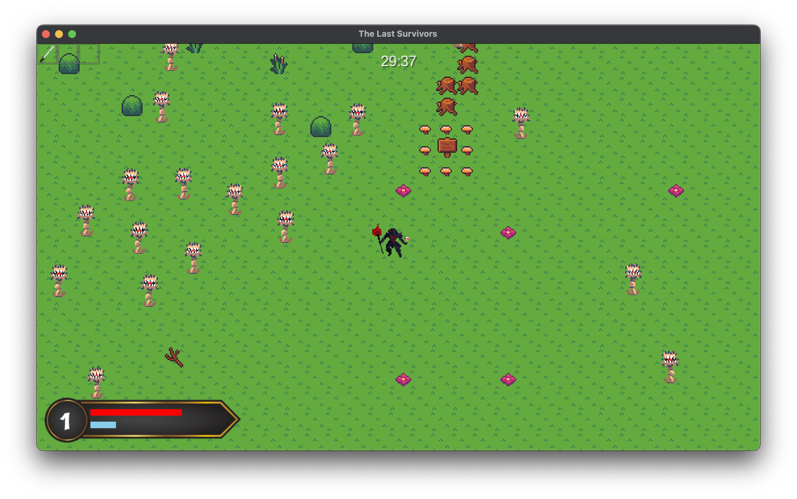
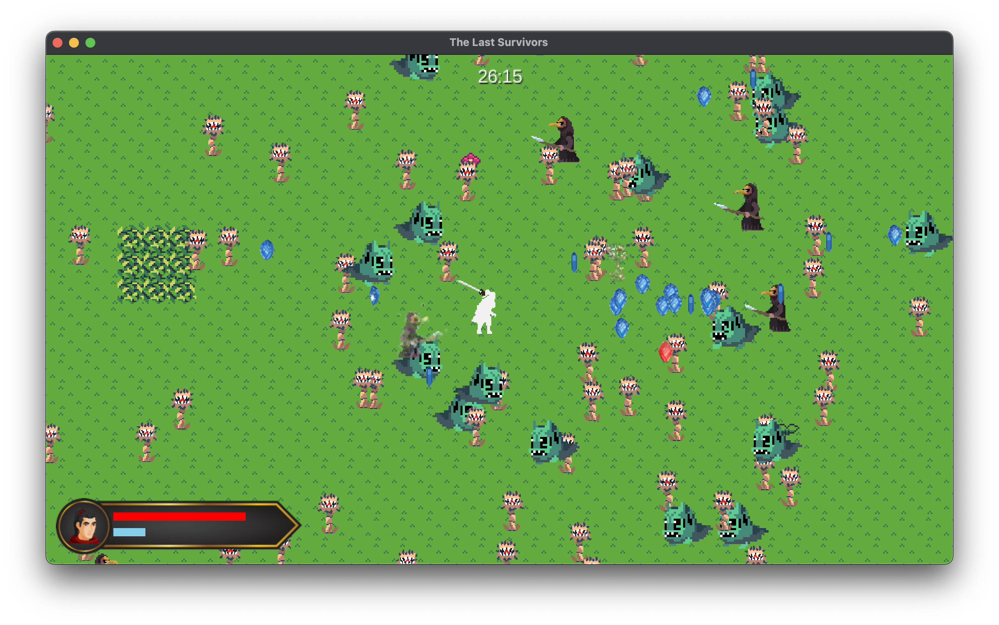

 <h1 align="center">the last survivors</h1>
 <br/>

In a world ravaged by monstrous creatures, humanity's survival hangs by a thread. Enter "The Last Survivors," an intense, adrenaline-pumping game that will test your mettle as one of the few remaining defenders of the human race. Your mission is to withstand a relentless 30-minute onslaught of nightmarish beasts that will stop at nothing to wipe you out.

As the clock ticks, your wits and reflexes will be pushed to the limit. Arm yourself with powerful weapons, sharpen your combat skills, and strategize to outmaneuver the enemy. The fate of humanity lies in your hands, and only your courage and determination can turn the tide of battle.

Dive into the world of "The Last Survivors" and prove you have what it takes to defend our species from the brink of extinction. Will you emerge victorious, or will the monstrous horde claim another victim? Time is of the essence - the fight for survival begins now!






## Setting up the production mode

1. Clone the repository
```bash
git clone https://github.com/polibuda-projects/the-last-survivors.git
```
2. Make sure you have `Java >=11` installed
3. Add executable permissions to `gradlew` script
```bash
chmod +x gradlew
```
4. Run script following command
```bash
./gradlew run
```